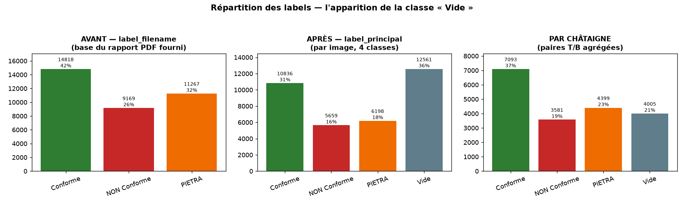
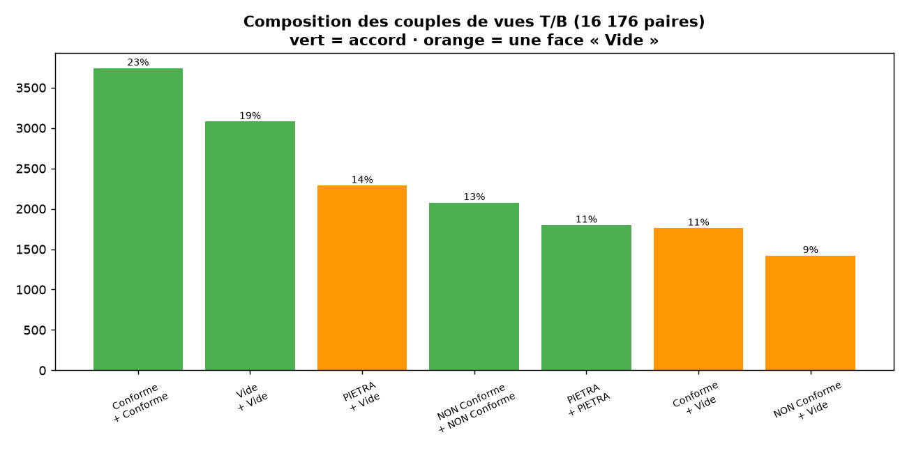
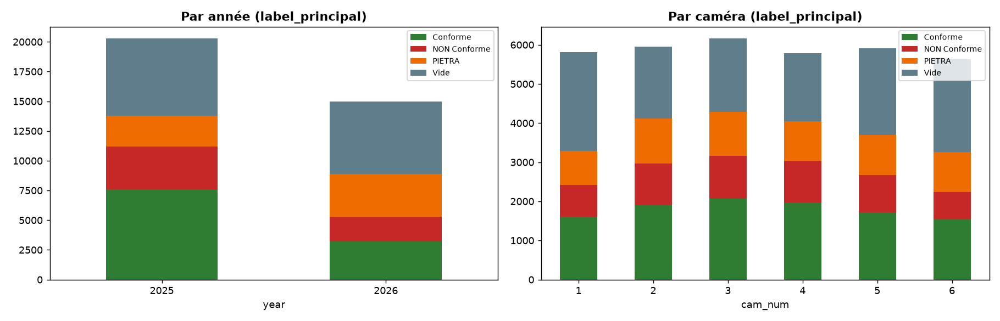
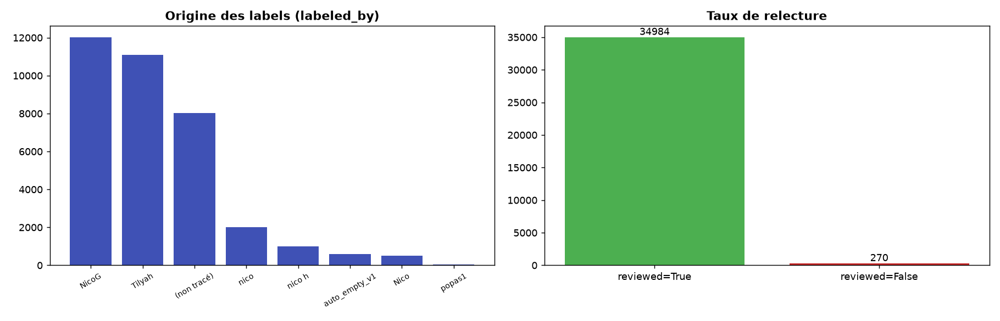

# Rapport de qualité du dataset — CastagNet (§4.1)

> Rapport **actualisé** produit à partir des vraies cibles d'entraînement
> (`label_principal`, 4 classes) et d'une reconstitution **par châtaigne**
> (appariement des vues T/B). Il corrige et complète le
> `Rapport_Dataset_Chataignes.pdf` fourni, qui est bâti sur `label_filename`
> (3 classes) et **ignore la classe « Vide »**.

## 1. Résumé exécutif

| Constat | Chiffre |
|---|---|
| Images totales | 35 254 |
| **Le rapport PDF fourni est obsolète** : il ne connaît pas la classe « Vide » | 0 « Vide » vs **12 561 réelles** |
| Images reclassées « Vide » lors de la relecture | **12 561 (35,6 %)** |
| Désaccords de classe (hors Vide) entre nom de fichier et label réel | **0** |
| Châtaignes reconstituées (paires T/B + orphelins) | **19 078** |
| Paires complètes T+B | 16 176 (84,8 %) |
| **Conflits « réels » entre vue T et vue B** (2 vraies classes) | **0** |
| Images non relues restantes | **270** (toutes PIETRA / caméra 6 / 2026) |
| Lignes `reviewed=True` mais sans auteur (`labeled_by` vide) | 7 763 |

## 2. Méthode

- **Source** : `labels_principal.csv` (35 254 lignes). Colonne cible = `label_principal`
  (`Conforme` / `NON Conforme` / `PIETRA` / `Vide`). `label_filename` (déduit du nom
  de fichier, 3 classes) sert de référence « avant ».
- **Appariement T/B** (`src/data/build_pairs.py`) : une châtaigne = 2 photos (caméra
  du dessus **T** + du dessous **B**). Clé d'appariement = nom de fichier privé de la
  position caméra (`_Cam_[TB]_` → `_Cam_X_`), qui regroupe année + classe + n° de lot
  + n° caméra + n° d'échantillon. Attention : les noms 2025 contiennent un n° de lot
  (`Conforme_1`), pas ceux de 2026 — la clé le gère automatiquement.
- **Reproductibilité** : `python src/data/build_pairs.py` puis
  `python src/data/quality_report.py` régénèrent `data/` et `reports/figures/`.

## 3. La classe « Vide » : ce que le rapport fourni cache



Le nom de fichier encode la classe **visée à l'acquisition** (le lot chargé était
« Conforme », « PIETRA »…). Mais un créneau photographié peut être **vide** (fruit
absent du champ). La relecture humaine + un détecteur automatique (`auto_empty_v1`)
ont donc reclassé **35,6 % des images en « Vide »** :

| label_filename | → reste sa classe | → reclassé « Vide » |
|---|---|---|
| Conforme (14 818) | 10 836 | 3 982 |
| NON Conforme (9 169) | 5 659 | 3 510 |
| PIETRA (11 267) | 6 198 | 5 069 |

**Aucune** image ne change entre deux vraies classes (Conforme↔PIETRA↔NON Conforme) :
le seul mouvement est *classe → Vide*. Le `label_filename` est donc un **plafond
fiable** de la vraie classe des fruits présents.

## 4. Appariement T/B et règle d'agrégation



Analyse des 16 176 paires complètes : **100 % des désaccords T/B impliquent « Vide »
d'un côté ; il n'existe aucun conflit entre deux vraies classes.** Autrement dit,
quand la châtaigne est visible des deux caméras, elles sont **toujours d'accord** sur
sa classe ; la « divergence » vient uniquement des cas où une caméra ne capte pas le
fruit (il apparaît « Vide » de ce côté).

**Conséquence métier majeure** : regarder **une seule** photo est trompeur — ~34 % des
châtaignes présentes semblent « Vide » sur l'une des deux vues. La décision doit se
prendre **sur la paire**. D'où la règle d'agrégation (implémentée) :

```
label_chataigne = classe NON-Vide parmi {T, B}
   • T et B d'accord          → cette classe
   • une face Vide, l'autre X → X   (le fruit est là, une caméra ne l'a pas capté)
   • les deux Vide            → Vide
```

Cette règle ne demande **aucun arbitrage** (0 conflit réel). Elle est aussi la plus
sûre vis-à-vis du cahier des charges (protéger la pureté du lot Conforme) : un défaut
visible d'un seul côté suffit à écarter le fruit.

**Effet sur l'équilibre des classes** — le passage image → châtaigne rééquilibre le
dataset (le « Vide » sur-représenté par image se résorbe) :

| Classe | Par image (`label_principal`) | Par châtaigne |
|---|---|---|
| Conforme | 10 836 (31 %) | **7 093 (37 %)** |
| PIETRA | 6 198 (18 %) | 4 399 (23 %) |
| Vide | 12 561 (36 %) | 4 005 (21 %) |
| NON Conforme | 5 659 (16 %) | 3 581 (19 %) |

## 5. Répartitions par année et caméra



- **Années** : 2025 = 20 266 images, 2026 = 14 988. Le profil de classes diffère
  (2026 plus riche en PIETRA/Vide) → surveiller un éventuel *distribution shift* et
  stratifier le split par année.
- **Caméras** : les 6 postes sont équilibrés en volume (~16–17,5 % chacun), mais la
  proportion de « Vide » monte sur les caméras 5–6 (positionnement/soufflage).

## 6. Traçabilité et relecture



- **Relecture** : 34 984 lignes `reviewed=True`, **270 restantes** (§4.1 à terminer via
  `labeling_tool/`) — toutes PIETRA, caméra 6, 2026.
- **Hétérogénéité du diagnostic** : labels produits par des opérateurs multiples
  (NicoG 12 018, Tilyah 11 080, nico/nico h/Nico 3 500, popas1 27) **et** un process
  automatique (`auto_empty_v1` 596). **7 763 lignes sont `reviewed=True` sans auteur**
  → traçabilité incomplète, à signaler comme risque qualité.
- **Tags** : `chunk` = 4 975 (débris / morceaux, pas un fruit entier), `multiple` =
  1 197 (plusieurs fruits), `mixed_quality` = **0** (tag jamais utilisé → à retirer ou
  documenter).
- **`labels_masked.csv`** (à ne pas modifier) : détecteur automatique vide/châtaigne
  couvrant 18,7 % des images (features `hot_frac`, `max_blob`), **cohérent à 99,1 %**
  avec la classe « Vide ». Exploitable comme *pseudo-label* ou garde-fou.

## 7. Décisions de constitution du dataset final (§4.2)

| Décision | Choix | Justification |
|---|---|---|
| Unité d'apprentissage | **la châtaigne (paire T/B)**, pas l'image | reflète la décision réelle de tri ; évite le piège « Vide sur une vue » |
| Règle de label | non-Vide gagne (cf. §4) | 0 conflit réel ; aligné cahier des charges |
| Orphelins (2 902 : 889 T, 2 013 B) | **conservés** comme mono-vue, marqués `has_T/has_B` | permet un modèle robuste à une vue manquante ; à exclure d'une évaluation *paire stricte* |
| 270 non relues | à **finir** avant gel du dataset | éviter des labels non validés dans le test |
| `chunk`/`multiple` | conservés comme métadonnées, **exclus** du set « fruit unique » pour l'entraînement principal | images ambiguës (débris, multi-fruits) |
| Split train/val/test | **groupé par `pairkey`** + stratifié classe & année | anti-fuite T/B **et** anti-fuite paire ; pas de même châtaigne des deux côtés |

## 8. Proposition — labellisation collaborative (§4.1)

Le CSV monolithe versionné par Git provoque des conflits de fusion dès que deux
personnes labellisent en parallèle. Propositions :

1. **Sharding par tranche** : un fichier par (année, caméra) sous `labels/2026_cam6.csv`,
   fusionnés par un script → conflits localisés, `git merge` trivial.
2. **Format append-only** (journal d'événements) : une ligne = une décision
   (`filename, label, auteur, timestamp`), le CSV final est une projection → pas de
   réécriture concurrente de lignes.
3. **`.gitattributes` merge=union** sur les fichiers de labels pour auto-fusionner les
   ajouts de lignes.
4. **Colonnes de traçabilité obligatoires** (`labeled_by`, `labeled_at`, `tool_version`)
   validées en pré-commit — corrige les 7 763 lignes sans auteur.
5. **Migration vers une petite base** (SQLite/Parquet + DVC) si l'équipe grandit.

## 9. Impact sur la modélisation (rappel des seuils)

Cahier des charges (Annexe A), mesuré sur un test représentatif :
**Conforme → rappel ≥ 85 % ET précision ≥ 95 %** (priorité à la pureté du lot).
Le déséquilibre (Vide/Conforme dominants) impose : split stratifié + groupé,
pondération de classes ou rééchantillonnage, et un **seuil de décision réglé sur la
précision Conforme** plutôt que l'argmax brut.
